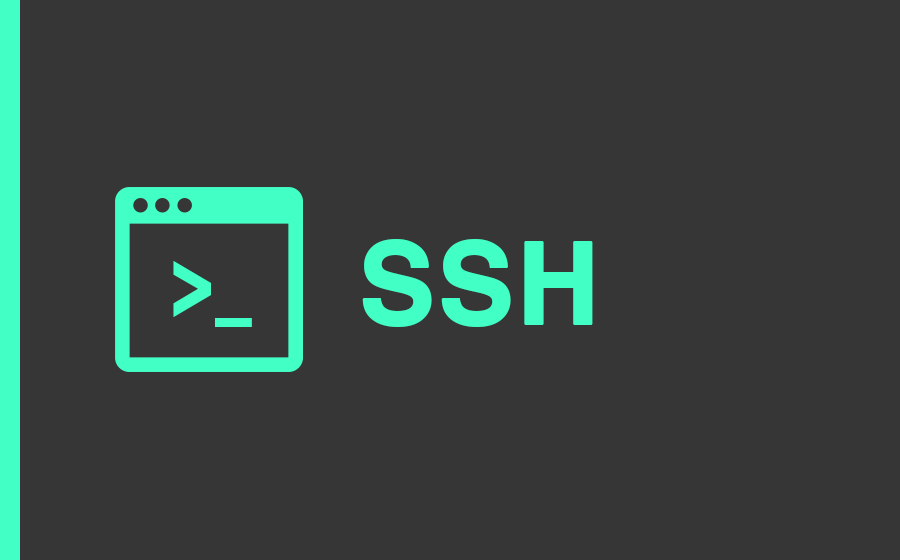

# SSH
My works related to Secure Socket Shell (SSH), a network protocol that gives users a secure way to access a computer over an unsecured network.

## Table of Contents
1. [Introduction.](#introduction)
2. [Official references websites.](#references)
3. [SSH developers.](#developers)
4. [GitHub notes.](#github)
5. [GitHub repository calculation.](#calculation)

<a name="introduction"></a>
## 1. Introduction.
 
Secure Shell (SSH) is a cryptographic network protocol for operating network services securely over an unsecured network. Typical applications include remote command-line, login, and remote command execution, but any network service can be secured with SSH.
<br /><br />
SSH provides a secure channel over an unsecured network in a client–server architecture, connecting an SSH client application with an SSH server. The protocol specification distinguishes between two major versions, referred to as SSH-1 and SSH-2. The standard TCP port for SSH is 22. SSH is generally used to access Unix-like operating systems, but it can also be used on Microsoft Windows. Windows 10 uses OpenSSH as its default SSH client.
<br /><br />
SSH was designed as a replacement for Telnet and for unsecured remote shell protocols such as the Berkeley rlogin, rsh, and rexec protocols. Those protocols send information, notably passwords, in plaintext, rendering them susceptible to interception and disclosure using packet analysis. The encryption used by SSH is intended to provide confidentiality and integrity of data over an unsecured network, such as the Internet, although files leaked by Edward Snowden indicate that the National Security Agency can sometimes decrypt SSH, allowing them to read the contents of SSH sessions.

<a name="references"></a>
## 2. Official references websites. 
SSH official website : https://www.ssh.com <br />

**_SSH related technologies_** <br />
FileZilla : https://filezilla-project.org <br />
PuTTY : https://www.putty.org/ <br />
git for windows : https://gitforwindows.org/ <br />

**_SSH documentation by ssh.com_**
sshd by ssh.com : https://www.ssh.com/ssh/sshd <br />

<a name="developers"></a>
## 3. SSH developers.
Edward Snowden : https://twitter.com/Snowden <br />
Tatu Ylonen : https://github.com/tatuylonen, https://ylonen.org, https://twitter.com/tjssh <br />
 
<a name="github"></a>
## 4. GitHub notes.
Clone the current GitHub remote repository contents into local machine.
```
$ git clone https://github.com/syakirharis25/SSH.git
$ cd SSH/
$ git remote -v
$ git status
```

<a name="calculation"></a>
## 5. GitHub repository calculation.
```
-------------------------------------------------------------------------------
Language                     files          blank        comment           code
-------------------------------------------------------------------------------
Markdown                         1              7              0             36
-------------------------------------------------------------------------------
```
Refer to : https://github.com/syakirharis25/cloc
